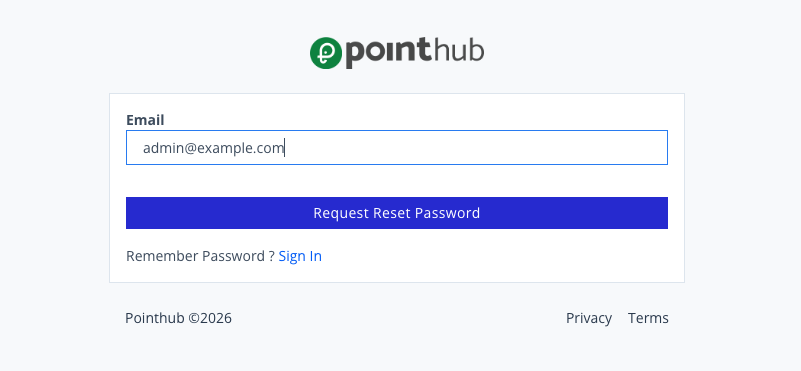
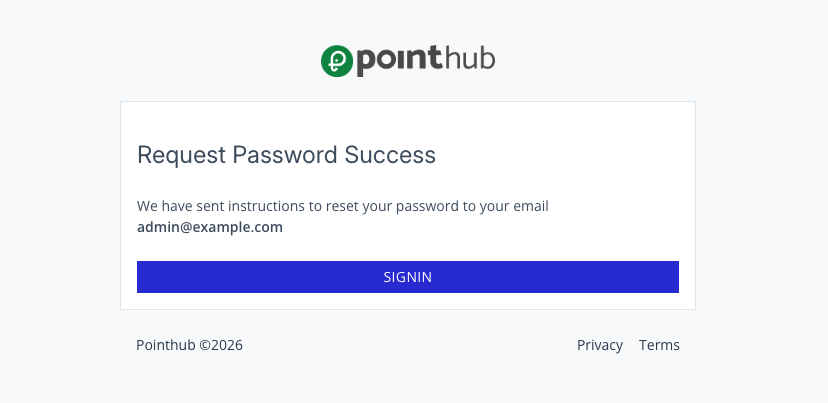

# Scenario 1.1.5. Forgot Password

## 1.1.5.S1. User can request password reset successfully.

- `GIVEN` user visit `/signin`
- `WHEN` user click button "forgot-password"

{.shadow-img}

- `WHEN` user type "admin@example.com" into input "email"
- `AND` user click button "request-reset-password"

{.shadow-img}

- `THEN` user redirected to home page.

{.shadow-img}