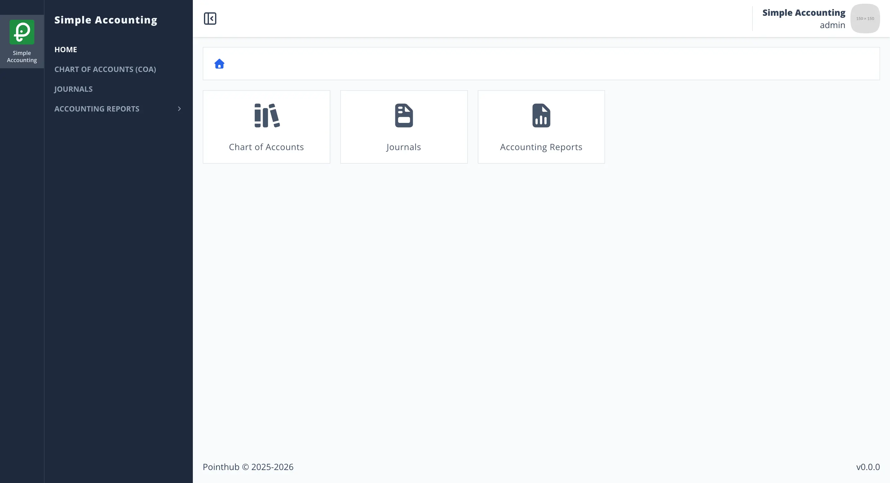
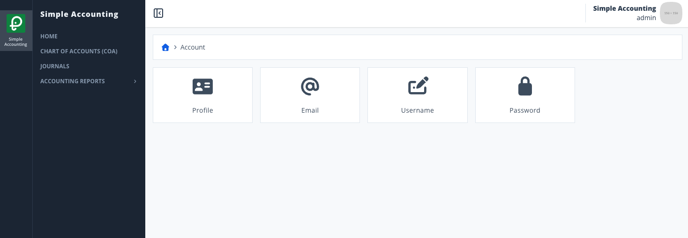
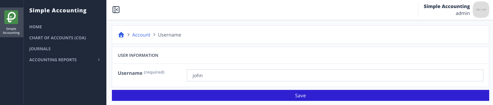

# Scenario 2.1. Update Username

## 2.1.F1. Username update fails when user is not authenticated.

{.shadow-img}

- `GIVEN` user visit `/signin`
- `WHEN` user type "admin" into input "username"
- `AND` user type "Admin123!" into input "password"
- `AND` user click button "sign-in"
- `THEN` user redirected to home page

{.shadow-img}

- `WHEN` user click account menu in top-right corner
- `AND` user click button "my-account"
- `THEN` system show popup "account-menu"

{.shadow-img}

- `WHEN` user click button

{.shadow-img}

- `WHEN` user type "admin" into input "username"
- `AND` user click button "save"

{.shadow-img}

- `THEN` user see "Authentication credentials is invalid".